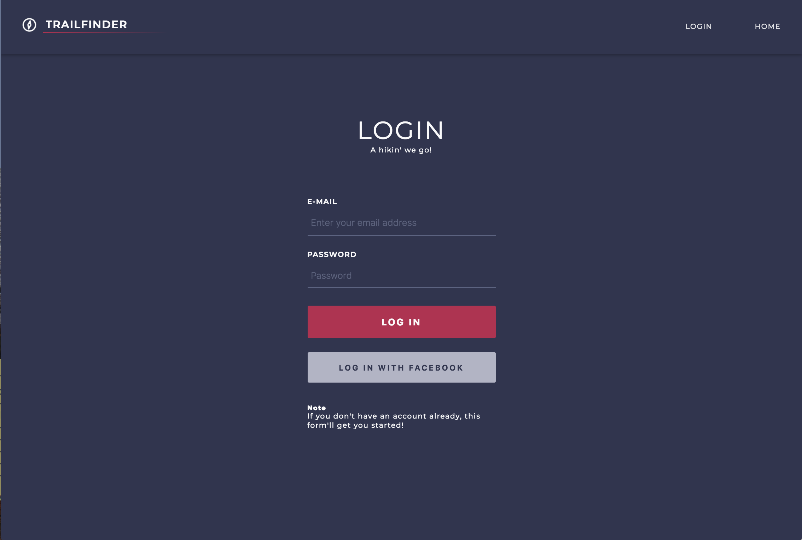
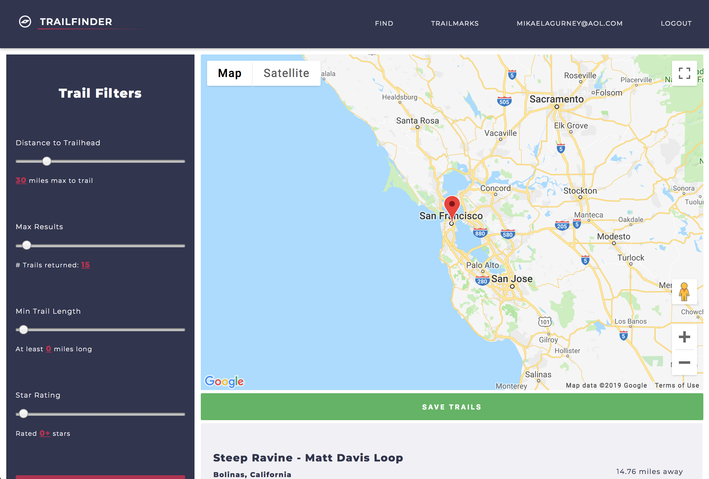
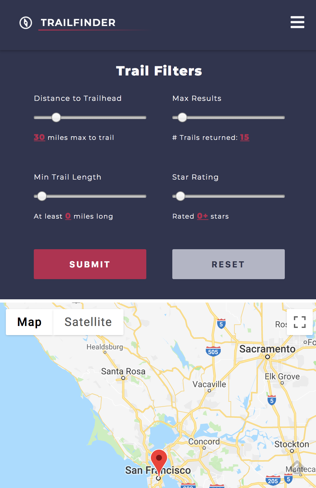
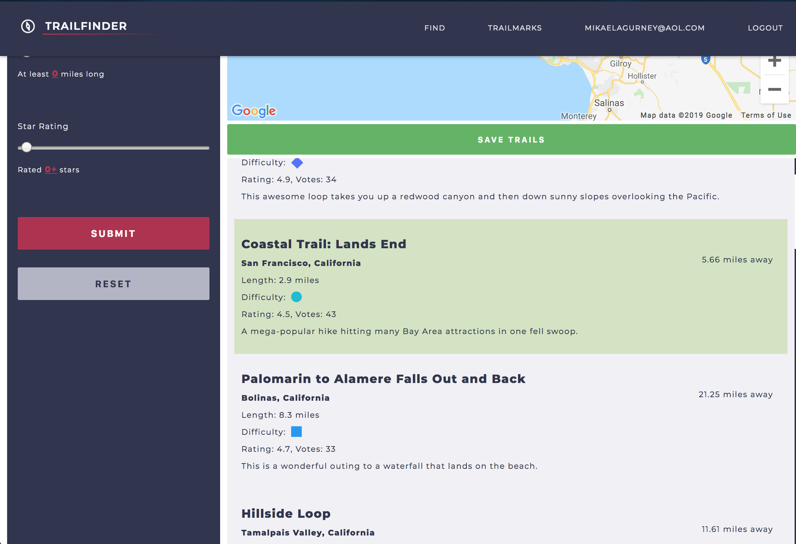
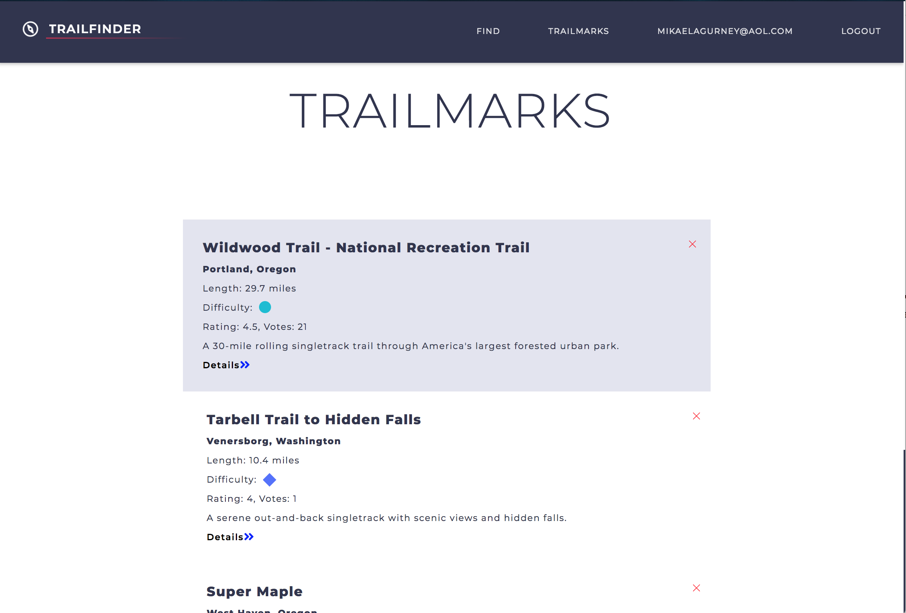

# TrailFinderV2

Welcome to TrailfinderV2!

> View Live at https://intense-tundra-32731.herokuapp.com/login

Version 1: https://github.com/Mikaelia/TrailFinder

## Motivation

Unlike TrailFinder1 which returned a random trail near your location, TrailFinder2 will return a list of trails based off of your specifications in your area, or the location that you select on a map. Click on the trails to select, and save them. Your saved trails are visible in the "Trailmarks" section of the application.

## Features

This application is built with React, and styled with CSS/Sass. I used Firebase's user authentication, and database functionality.

In this version of Trailfinder, I removed Redux because I felt that it was unnessary for an application of this size, and wanted to practice working with Firebase without Redux.

TrailFinder2 includes a Facebook OAuth login option, trail search filters, and an automatically updating, and provides users with a pre-populated trail list based on their geolocation.

This app can:

- [x] Allow you to create your own account, and login with either email/pass or via Facebook
- [x] Return a list of trails near you, based off of your geolocation
- [x] Show users their distance to listed trails
- [x] Give you the power to pre-filter the trails that are returned, and select your own region on a map to search for trails
- [x] Let users select and save your favorite trails, which may then be viewed in the "Trailmarks" section of the application

In Progess:

- [ ] Provide modal on "detail" link on saved trails, which will show more trail details, pictures, and a directions to trailhead
- [ ] Create necessary alerts for user interaction
- [ ] Provide sort options for trailmarks
- [ ] Provide key for difficulty rating
- [ ] Design homepage

## Getting Started

- clone or download the repository
- run `npm install` to install dependencies
- run `npm start` to start the application

### Live Example

- View live at https://intense-tundra-32731.herokuapp.com/login

#### Download

- Clone or download this repository:
  - `git clone https://github.com/Mikaelia/TrailFinder-V2/edit/master/README.md`
- run `npm install` to install dependencies
- run `npm start` to open on browser with localhost

#### Build CSS

- run `npm run build:css` to compile, compress, and prefix css

## ScreenShots

